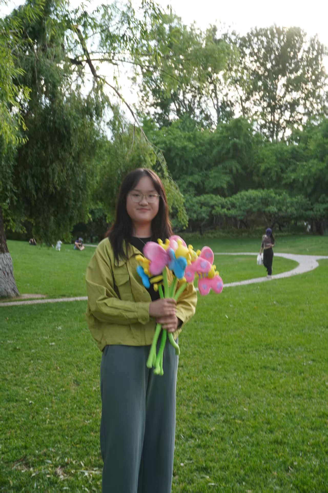

---
# 网页标题和基础设置（固定格式）
layout: home
title: Bingtong Han
---

# Bingtong Han 韩冰童
**Undergraduate | Tsinghua University**

---

## Self-Introduction
Hi! I am **Bingtong Han** from School of Economics and Management, Tsinghua University. My major is Economics and Finance (and perhaps there will be a minor in the future).   

  

  

More About me:  
- Date of Birth: June 3rd, 2005
- MBTI: INTJ (former ENTJ)
- Field of Interest (might not be good at🤦‍♀️): Economics and Business (Finance, Accounting, Management, etc.), Chemistry, Biology, Statistics (just a beginner)
- A former Science student in high school who entered the field of Economics and Finance by chance  

---

## Educational Background
**School of Economics and Management (SEM), Economics and Finance, Tsinghua University**, 2023.9-present  

Related courses:
- **Economics and Business Related:** Corporate Finance, Intermediate Financial Accounting, Intermediate Microeconomics, Principles of Economics, Principles of Accounting, Alternative Investment (Harvard Business School Certificate)
- Math Related: Probability and Mathematical Statistics, Elementary Probability Theory, Statistical Inference (Audit), Calculus, Linear Algebra
- Programming Related: Computer Language and Programming, Insight from Financial Industry
- Some Other Interesting Courses I Took (not all): Organic Chemistry, Physics, Laboratory of Modern Biology, Writing and Communication, Critical Thinking and Moral Reasoning, Research Writing Seminars

---

## Internship Experience
- **Boston Consulting Group, Part-Time Assistant**, 2024.12-present

  * Responsible for compiling project meeting minutes, accurately capturing key information from meetings to ensure the project team has a consistent understanding and efficient execution of the audio product e-commerce market expansion strategy  
  * Organized and analyzed vendor due diligence reports, providing the team with in-depth insights into the market position of the client, dynamics of competitors, and potential market opportunities  
  * Participated in expert interviews and physical store visits, gathering opinions and suggestions from industry experts and front-line sales personnel on the promotion of audio products in the e-commerce market, analyzed potential growth points, and provided empirical support for project strategy formulation  
  * Assisted in the development of the e-commerce market expansion plan for audio products, driving the smooth progress of the project and helping the client achieve market objectives

---

## Research Experience
- **Institute for State-owned Enterprises, Tsinghua University, Research Assistant**, 2025.1-present　　

  "Beijing Pilot State-owned Enterprise Policy Evaluation"

  Prof. Chong-En Bai, Director Lisha Zhou

  * Engaged in in-depth interviews with senior and management levels of enterprises, focusing on policy areas such as human resources and incentives, technological innovation, governance empowerment, and capital operations, to gather primary data and insights
  * Organized interview results and processed and interpreted survey data to provide empirical support for policy evaluation

- **Institute for State-owned Enterprises, Tsinghua University, Research Assistant**, 2024.7-2024.8　　

  "Equity Incentive for State-owned Enterprises" and "Giving Play to the Role of Independent Directors of State-owned Holding Listed Companies"

  Prof. Chong-En Bai, Director Lisha Zhou

  * Collected and sorted out the state-owned enterprise equity incentive related literature, wrote the project literature review  
  * Wrote research reports based on the equity incentive data of state-owned holding listed companies and the interview materials of related enterprises  
  * Collected relevant information of the independent directors of state-owned holding listed companies, wrote research reports and made PPT  

---

## Skills
- Programming: Python, R, C
- Microsoft (Excel, PowerPoint, etc.)
- Language: Chinese Mandarin (Proficient), English (Advanced)

---

## Other Experiences

### Social Work in Tsinghua
- **School of Economics and Management, Student Union, Overseas Department**, 2023.3-present
  * Responsible for editing the “Business English” column of the Tsinghua SEM Family WeChat official account, leading the team to produce multiple articles, providing practical English learning guidance for students  
  * Holly Jolly Get-Together New Year’s event sharing guest and organizer  
  * Participated in the buddy program for two semesters, helping exchange students adapt to life at Tsinghua  
  * Organizer and host of the Speaking Buddy Program, strengthening communication between exchange students and domestic students  

- **School of Economics and Management, Class 36, Study Committee Member**, 2024.9-present

### Social Practice Activities
- **Tsinghua University "RONG TONG WAN XI, ZHI HUI JINZHAI" social practice**, 2024.7  
  *To Jinzhai County, Anhui province to conduct research on inclusive finance and digital transformation*  
  * Talked with local government to understand local economic development and construction; investigated local commercial banks and policy banks to understand the current situation of inclusive finance; investigated local characteristic enterprises to learn about local economic development and digital transformation; interviewed local villagers to understand rural construction  
  * Served as deputy team leader and research team leader, leading the research work of the detachment; undertook the responsibilities of investigation and interview, data sorting and report writing
  * Was awarded the Silver Prize for Social Practice by School of Economics and Management  

- **Tsinghua University "YI XING QIAN LI" social practice**, 2024.2  
  *To Shangri-La and Lanping County in Yunnan province to conduct research on green finance and rural revitalization*  
  * Investigated the construction and management of Shangri-La Alpine Botanical Garden; investigated forest farms to understand the construction and development status of forestry; interviewed local farmers to understand the rural revitalization situation
  * Took on the responsibility of research and interview, report writing and project presentation materials preparation; completed the reports of five sub-projects and submitted them to CICC

- **Tsinghua University "XING LUO CHANG AN" social practice**, 2024.1  
  *To Xi'an and Luoyang for commercial aerospace related research*  
  * Interviewed a total of 12 enterprises to investigate the status quo of incubation and technology transfer of science and technology enterprises, the situation and operation of different enterprises in the upstream and downstream industrial chain of commercial space industry, the different situations faced by state-owned enterprises and private enterprises, as well as their competition and cooperation  
  * Took on the responsibility of commercial aerospace industry data, literature, as well as some enterprise data collection, the design of research problems, research data collation and research reports writing
  * Was awarded the Gold Prize for Social Practice by Department of Mechanical Engineering  

### Volunteer Activities
- 20th Annual Conference of Association of Asia-Pacific Business Schools, volunteer  
- TEDxTHU, translator  
- 22nd “Your Voice, My World” event, volunteer  
- Admissions Volunteer for Tsinghua University

---

## Awards
- Social Practice Excellence Scholarship, 2024
- Soh Bing Scholarship, 2024
- Tsinghua University "Ma Yuehan Cup" Cheerleading Competition, 5th place, 2024.4
- Excellent Individual in Social Practice, Department of Mechanical Engineering, 2024.3

---

## Reports/Theses/Projects  
(mostly informal🤔)  

###  Reports
- 华为公司估值分析报告
- Financial Analysis of S.F. Holding Co., Ltd.
- Financial Analysis of Chinese Electric Appliances Industry: Hisense, Skyworth, TCL

### Theses
- 零实施与数次实施——中印药品专利强制许可实施对比及原因（获清华大学“讲好科学的故事”科普大赛最佳深度奖）
- Study on Ethics in Users’ Information and Data Collection of Social Media Enterprises
- 雪糕真的是“刺客”吗？ (my Principles of Economics course thesis, just for fun🙂)
- 
### Projects
- 咪咕视频案例分析
- 云南省兰坪县新生桥国有林场德胜营林区中金公益生态碳汇林项目

---

## Contact
- Email: hanbt23@mails.tsinghua.edu.cn
- GitHub: [My GitHub](https://github.com/BingtongHan)
